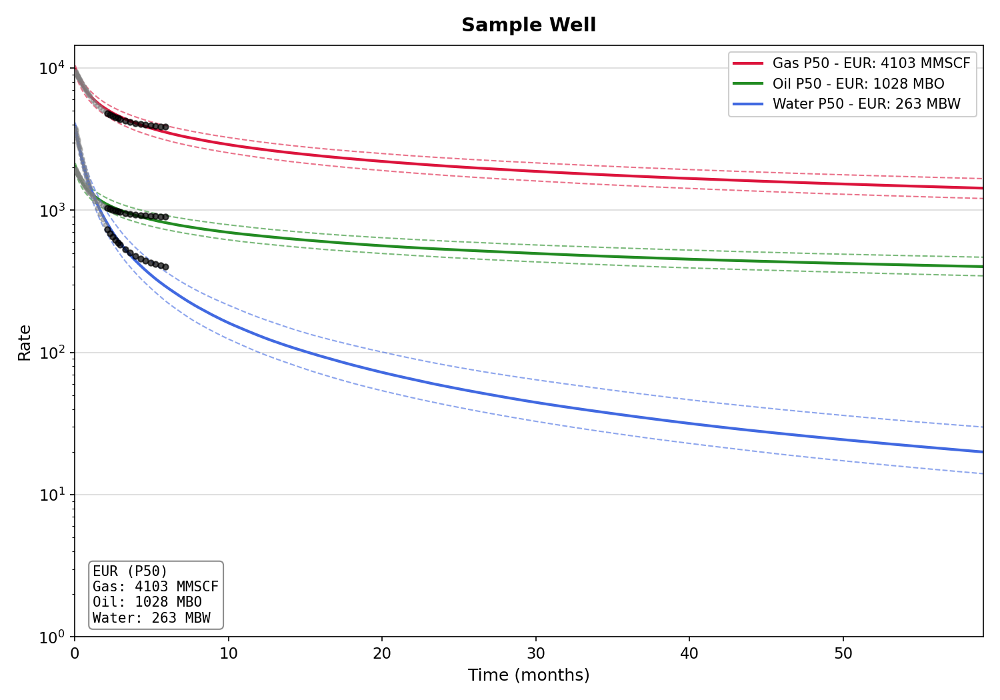

# Waller Decomposition

**Multi-Resolution Wavelet EUR Forecasting for Unconventional Wells**

**Author:** Eric Waller  
**Version:** 3.1  
**License:** All Rights Reserved (see LICENSE)

## What It Does

Forecasts EUR (Estimated Ultimate Recovery) with P10/P50/P90 uncertainty bounds for:
- **Gas wells** (MMSCF)
- **Oil wells** (MBO)  
- **Water production** (MBW)

Features:
- Multi-phase forecasting (gas, oil, water)
- GOR/WOR/WGR ratio tracking
- Flowback period detection (first 60 days flagged)
- Confidence bands (P10-P90)
- CSV export for ARIES/PHDWin import
- Batch mode for multi-well portfolios

## Installation

pip install -r requirements.txt

## Quick Start

### Single Well

python3 run_example.py sample_well.csv

Outputs:
- sample_well_forecast.png - Plot with P10/P50/P90 bands
- sample_well_forecast.csv - Daily forecast for import

### Batch Mode (Multiple Wells)

mkdir wells
cp *.csv wells/
python3 run_example.py --batch ./wells/

Outputs:
- Individual plots and CSVs per well
- batch_summary.csv - Portfolio summary
- Portfolio totals (P50)

## Input Data Format

CSV with these columns:

| Column | Description | Units | Required |
|--------|-------------|-------|----------|
| days | Days since first production | days | Yes |
| pressure_psi | Flowing pressure (THP or BHP) | psi | Yes |
| rate_mscfd | Gas rate | MSCF/day | If gas well |
| rate_bblpd | Oil rate | bbl/day | If oil well |
| rate_bwpd | Water rate | bbl/day | Optional |

### Data Requirements
- Minimum: 30+ days (90+ preferred)
- Remove or interpolate shut-in periods
- Small gaps (<30 days) acceptable

## Output Interpretation

| Value | Meaning |
|-------|---------|
| P10 | 90% chance EUR exceeds this (conservative) |
| P50 | Best estimate (median) |
| P90 | 10% chance EUR exceeds this (optimistic) |

## Repository Contents

| File | Description |
|------|-------------|
| run_example.py | Main forecasting tool |
| sample_well.csv | Example 10,000 ft Permian Wolfcamp A well |
| waller_decomposition_v3.md | Technical white paper |
| requirements.txt | Python dependencies |

## Citation

Waller, E. (2026). The Waller Decomposition: Multi-Resolution Wavelet EUR
Forecasting for Multi-Stage Fractured Horizontal Wells. Technical White Paper v3.0.

## License

Copyright (c) 2026 Eric Waller. All Rights Reserved.

For licensing inquiries: ewaller.com

## Contact

- Website: ewaller.com
